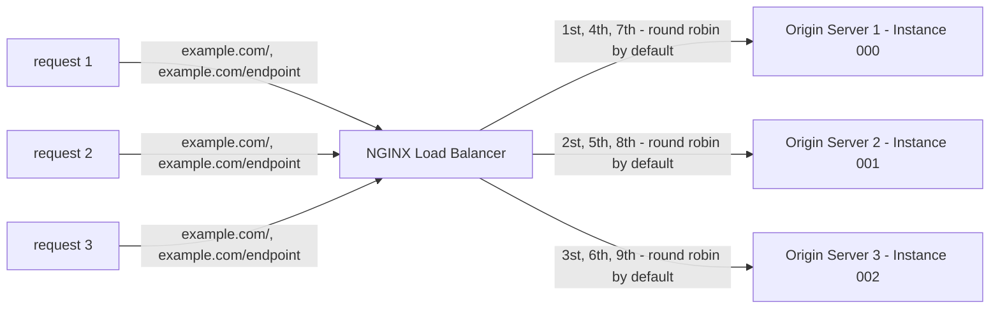
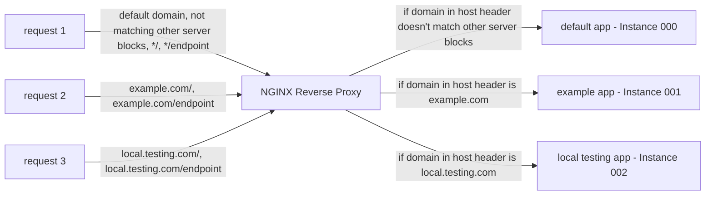
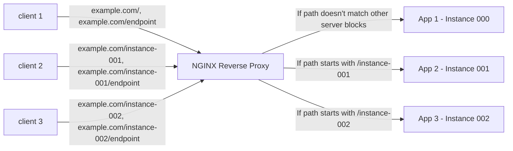
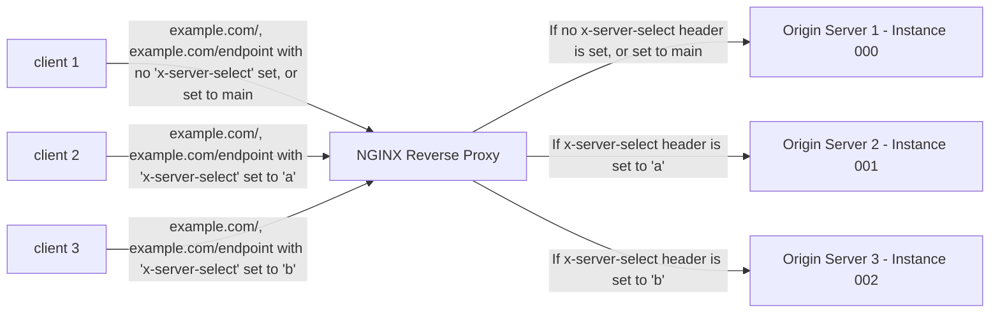

# NGINX Examples

This repo shows some example configurations for NGINX. The goal is to make it quicker/easier to configure NGINX for each example use case.

## Table of Contents
- [NGINX Examples](#nginx-examples)
  - [Table of Contents](#table-of-contents)
  - [How to Run the Examples](#how-to-run-the-examples)
  - [Use Cases](#use-cases)
    - [Reverse Proxy - Load Balancer](#reverse-proxy---load-balancer)
    - [Reverse Proxy - Host Routing](#reverse-proxy---host-routing)
    - [Reverse Proxy - Path Routing](#reverse-proxy---path-routing)
    - [Reverse Proxy - Header Routing](#reverse-proxy---header-routing)
    - [Web Server (TODO)](#web-server-todo)
    - [Web Server - React/SPA (TODO)](#web-server---reactspa-todo)
    - [TLS/SSL/HTTPS Termination (TODO)](#tlssslhttps-termination-todo)
    - [Basic Auth (TODO)](#basic-auth-todo)
    - [External Auth (TODO)](#external-auth-todo)
    - [Run JS (TODO)](#run-js-todo)

## How to Run the Examples
You can run any of the below examples by running the following commands in a bash shell. You will need Docker installed.

Start NGINX and some example origin apps (micro-express) by running: `./script.sh restart ./header-routing`

Run some example tests to show output by running: `./script.sh test ./header-routing`

If you would like to play around with requests yourself via cURL (or other HTTP request tool), you can run the commands "Test yourself by running" example commands that are shown when running the tests. Or refer to the `test.sh` file in the respective example directory.

Cleanup containers by running: `./script.sh stop`

## Use Cases

Here are some use cases which have an example in this repo.

### Reverse Proxy - Load Balancer

`./script.sh restart ./load-balancer && ./script.sh test ./load-balancer`

See code: [./load-balancer](./load-balancer)

Round robin load balancer to distribute requests among multiple origin servers.

This would be useful if you have the app running on multiple servers for load or redundancy reasons, and want to balance requests between them. By default the load balancing algorithm is round robin, but this can be configured.

The test example for this repo runs a few requests to show how they are balanced between different origin servers. Then the 001 and 002 origins are stopped, and the test shows that the load balancer detects that 001 and 002 are inaccessible and all requests now go to 000. Then 001 and 002 are started again, and the test shows how all requests are again balanced between 000, 001, and 002.

Docs: https://nginx.org/en/docs/http/load_balancing.html

### Reverse Proxy - Host Routing

`./script.sh restart ./host-routing && ./script.sh test ./host-routing`

See code: [./host-routing](./host-routing)

Reverse proxy which sends requests to different origin servers based on the host header. The host header is set by the browser automatically with each request.

This is useful for running multiple apps with different URLs.

For example:
- jaymartmedia.com, abc.com goes to instance 000 (fallback if not matching other server blocks)
- example.com goes to instance 001
- local.testing.com goes to instance 002

### Reverse Proxy - Path Routing

`./script.sh restart ./path-routing && ./script.sh test ./path-routing`

See code: [./path-routing](./path-routing) 

Reverse proxy which sends requests to different origin servers based on the path/sub-directory in the URL.

This could be useful if you want to run multiple apps on the same domain. Every request comes into the NGINX reverse proxy on example.com, then requests are sent to different origin servers/urls/ports based on the path after the URL.

### Reverse Proxy - Header Routing

`./script.sh restart ./header-routing && ./script.sh test ./header-routing`

See code: [./header-routing](./header-routing) 

Reverse proxy which sends requests to different origin servers based on certain request headers.

I don't see a ton of use for this, but I'm sure there are some.

One use case that I have seen in a professional application was using a header to test a blue/green deployment. The main app was running on example.com, requests without special headers go here. The preview app runs on the same domain (example.com), but requests only get forwarded to the preview app if the special header is set.

I could also see a potential use case for enabling you to directly hit a particular origin server, perhaps for testing. This is how the example in this repo is setup.

### Web Server (TODO)

Act as a web server and serve static files.

### Web Server - React/SPA (TODO)

Act as a web server and serve static files for a single page application (SPA). The difference between this and the standard web server is that an SPA typically only has a single /index.html file which is returned as a fallback.

Each incoming request has it's path checked against the directory structure. If a file matching the path is found, then it is returned. This is used for returning .css,.js, and image files. If a matching file is not found, then the root index.html file is returned. The UI is rendered on the client based on the path, as opposed to the server.

### TLS/SSL/HTTPS Termination (TODO)

Setup HTTPS certifications and use them in NGINX to secure traffic to NGINX.

### Basic Auth (TODO)

Setup Basic Auth in NGINX.

### External Auth (TODO)

Setup external OAuth in NGINX.

### Run JS (TODO)

Run JS upon each request by using ngx-js.